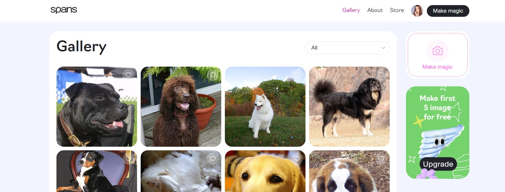
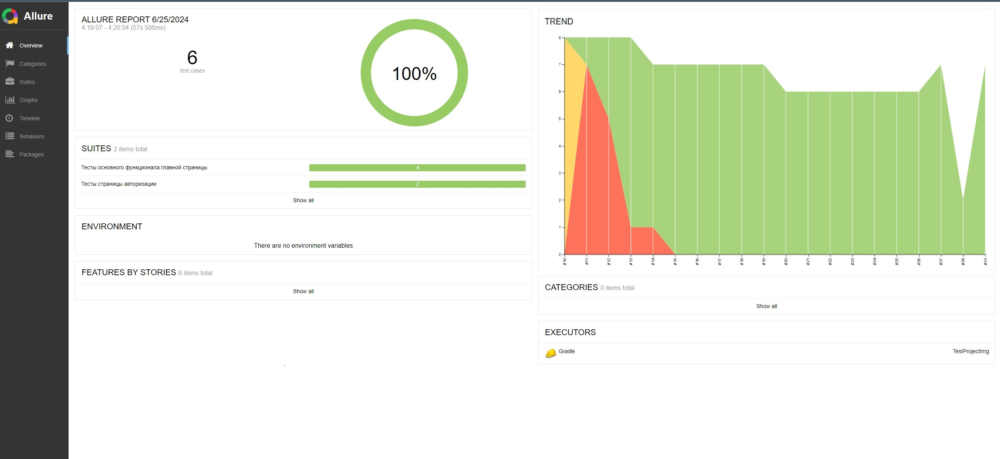
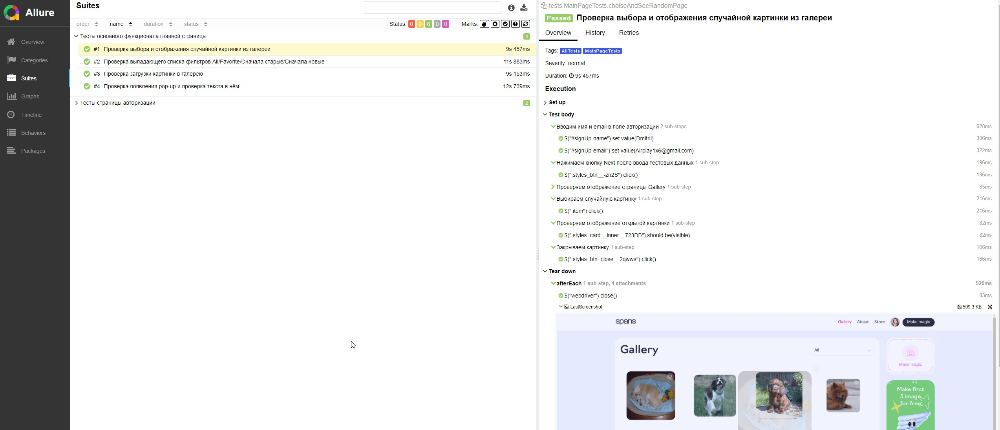

# Проект по автоматизации проверок основного функционала AI генератора картинок от Spans



## :scroll: Содержание:

- [Используемый стек](#computer-используемый-стек)
- [Список тестов проекта](#computer-список-тестов-проекта-funpay)
- [Запуск автотестов](#arrow_forward-запуск-автотестов)
- [Пример Allure-отчета](#-пример-allure-отчета)
- [Видео примера запуска тестов в Selenoid](#-Selenoid--Видео-прохождения-теста-в-отчете)

## :computer: Используемый стек

<p align="center">
<a href="https://www.java.com/">
<a href="https://selenide.org/">
<a href="https://aerokube.com/selenoid/">
<a href="https://github.com/allure-framework/allure2">
<a href="https://gradle.org/">
<a href="https://junit.org/junit5/">
<a href="https://github.com/">

</p>

- Язык для написания тестов : [Java](https://www.java.com/ru/)
- Фреймвокр тестирования : [Selenide](https://selenide.org/) 
- Фреймворк для модульного тестирования : [Junit5](https://github.com/junit-team/junit5)
- Система автоматической сборки : [Gradle](https://github.com/gradle) 
- Для использования различных браузеров в тестировании : [Selenoid](https://aerokube.com/selenoid/).
- Отчеты о пройденных тестах формируются при помощи : [Allure](https://github.com/allure-framework)

## :computer: Список auto-тестов проекта 
* Проверка успешной авторизации с подготовленными тестовыми данными
* Проверка успешной авторизации с тестовыми сгенерированными данными
* Проверка выбора и отображения случайной картинки
* Проверка удаления всех картинок и появление Pop-up
* Проверка загрузки картинки на сервис
* Проверка функционала фильтров для картинок в галерее


## :arrow_forward: Запуск автотестов

### Команда запуска тестов локально в IDE
* <code>gradle allTests -Dhost=local </code> : Запуск всех тестов 
* <code>gradle mainPageTests -Dhost=local </code> : Запуск тестов главной страницы
* <code>gradle authPageTests -Dhost=local</code> : Запуск тестов на странице авторизации

### Команда запуска тестов удалённо 
```
* <code>gradle allTests -Dhost=remote </code> : Запуск всех тестов 
* <code>gradle mainPageTests -Dhost=remote </code> : Запуск тестов главной страницы
* <code>gradle authPageTests -Dhost=remote </code> : Запуск тестов на странице авторизации
```
При запуске удалённо тест будет выполняться удаленно в браузере при помощи <code>Selenoid</code>

##  Пример [Allure-отчета](https://jenkins.autotests.cloud/job/Pikabu_UI_Project/32/allure/)
### Overview

<p align="center">


</p>

###  Selenoid : Видео прохождения теста в отчете

При интеграции с <code>AllureReports</code> вместе с общим результатом  тест-кейса прикладываются media файлы : скриншот и видео. Вот пример видео в отчете о завершенном тесте: 
<p align="center">
  
</p>
